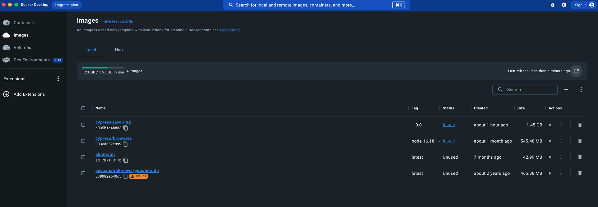
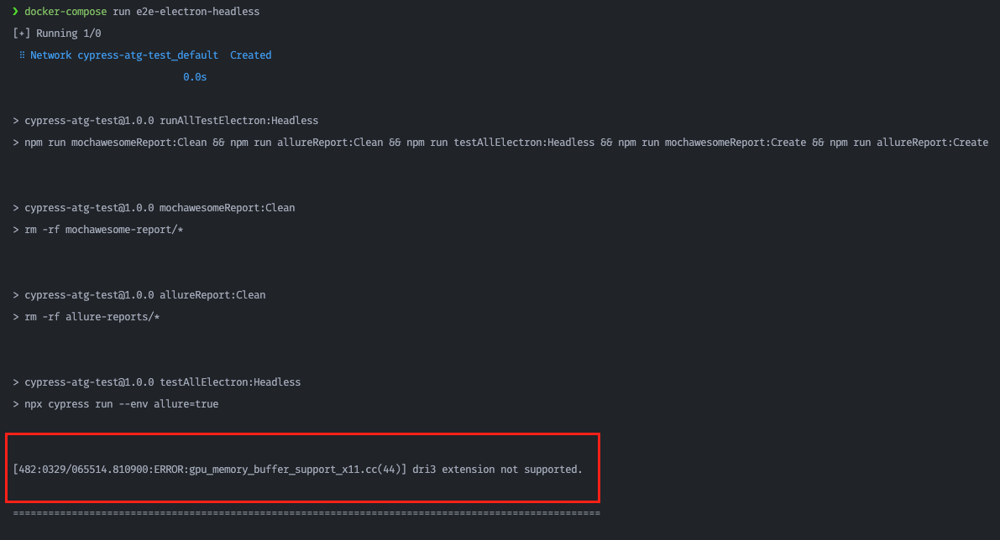

<p align="center">
  <a href="" rel="noopener">
 </a>
</p>

<h1 align="center">cypress-atg-test</h1>

---

<p align="center"> 
    <strong>Tung Huynh - Cypress automation test project for ATG</strong>
    <br> 
</p>

## 📝 Table of Contents

- [About](#about)
- [Getting Started](#getting_started)
- [Using Docker](#using_docker)

## 🧐 About <a name = "about"></a>

This is a Github repository belonging to user "cody-htt" and is named "cypress-atg-test". The
repository contains code related to testing an application using the Cypress testing framework.
Specifically, the tests in this repository appear to be related to the Automotive Transformation
Group (ATG) interview test for QA Engineer position.

The README file of this repository provides more detailed information on how to set up and run the
tests. Additionally, the repository may contain other relevant files and resources related to the
testing process.

## 🏁 Getting Started <a name = "getting_started"></a>

These instructions will get you a copy of the project up and running on your local machine for
development and testing purposes. See [Prerequisites](#prerequisites) and
[Steps to run cypress test](#steps_to_test) for notes on how to build the project on a live system.

### Prerequisites <a name = "prerequisites"></a>

<details open>

<summary>Java Installation</summary>

<br/>

To use allure-commandline to generate allure-reports, you need to install java 8 at least or higher
version. Can follow my below instruction:

For Windows:

1. Download the Java 8 installer for Windows from the Oracle website
   https://www.oracle.com/java/technologies/javase/javase-jdk8-downloads.html **_(register an oracle
   account if you don't have one)_**
2. Run the installer by double-clicking on the downloaded file.
3. Follow the instructions provided by the installer to complete the installation process.
4. Verify that Java 8 is installed by opening a Command Prompt and running the following command:

```
java -version
```

<br/>

For MacOS:

1. Install Homebrew by running the following command in a Terminal window:

```
/bin/bash -c "$(curl -fsSL https://raw.githubusercontent.com/Homebrew/install/HEAD/install.sh)"
```

2. Use Homebrew to install Java 8 by running the following command:

```
brew install openjdk@8
```

3. Verify that Java 8 is installed by opening a new Terminal window and running the following
   command:

```
java -version
```

</details>

### Steps to run cypress test <a name = "steps_to_test"></a>

1. Clone the repository using the following command

```
git clone https://github.com/cody-htt/cypress-atg-test.git
```

2. Navigate to the cloned repository using the following command:

```
cd cypress-atg-test
```

3. Install the necessary dependencies using the following command:

```
npm install
```

4. Run the tests using the following command:

```
npm run runAllTestElectron:Headless
```

or

```
npm run runAllTestElectron:Headed
```

5. Open _index.html_ in the allure-reports folder to view the test results or executing the
   following command under the `cypress-atg-test` folder

```
allure open allure-reports
```

## 🐳 Using DockerFile <a name = "using_docker"></a>

These guidelines will aid you in executing the test with ease, sans the hassle of installing Java on
your machine. I've taken the liberty of creating a _DockerFile_ to tailor the **cypress:browser**
docker image, complete with a pre-installed Java package, to generate the allure report after test
execution. For detailed instructions on installing docker/docker-compose and conducting Cypress e2e
tests within docker containers, please refer to [Docker Installation](#docker_installation) and
[Steps to run cypress with docker container](#steps_to_test_with_docker) respectively

### Docker Installation <a name = "docker_installation"></a>

<details open>

<summary>Install docker and docker-compose</summary>

<br/>

For Windows:

1. Download the Docker Desktop installer for Windows from the Docker website:
   https://www.docker.com/products/docker-desktop
2. Run the installer by double-clicking on the downloaded file.
3. Follow the instructions provided by the installer to complete the installation process.
4. Once Docker Desktop is installed, open it from the Start menu or by searching for "Docker
   Desktop" in the search bar.
5. Verify that Docker is installed by opening a Command Prompt and running the following command:

```
docker version
```

6. To install Docker Compose, download the installer from the Docker website:
   https://docs.docker.com/compose/install/
7. Run the installer by double-clicking on the downloaded file.
8. Verify that Docker Compose is installed by opening a Command Prompt and running the following
   command:

```
docker-compose version
```

<br/>

For MacOS:

1. Download the Docker Desktop installer for Windows from the Docker website:
   https://www.docker.com/products/docker-desktop
2. Run the installer by double-clicking on the downloaded file.
3. Follow the instructions provided by the installer to complete the installation process.
4. Once Docker Desktop is installed, open it from the Launchpad or by searching for "Docker Desktop"
   in Spotlight.
5. Verify that Docker is installed by opening a Terminal window and running the following command:

```
docker version
```

6. To install Docker Compose, open a Terminal window and run the following command:

```
sudo curl -L "https://github.com/docker/compose/releases/download/1.29.2/docker-compose-$(uname -s)-$(uname -m)" -o /usr/local/bin/docker-compose
```

7. After the download is complete, apply executable permissions to the Docker Compose binary by
   running the following command:

```
sudo chmod +x /usr/local/bin/docker-compose
```

8. Verify that Docker Compose is installed by running the following command:

```
docker-compose version
```

</details>

### Steps to run cypress with docker container <a name = "steps_to_test_with_docker"></a>

<details open>

<summary>Execute Cypress test in Docker Container</summary>
<br/>
Follow these steps to build and conduct Cypress e2e test in docker container:

1. Open the terminal window and Navidate to the **cypress-atg-test** directory with this command:

```
cd [_PATH_]/cypress-atg-test
```

2. Build the image with _DockerFile_ using this command:

```
docker build -t cypress-java-img:1.0.0 .
```

3. After the build process completes, open the Docker Dashboard to verify the docker image is built
   successfully 
4. In the same terminal, execute the below command to conduct the Cypress e2e test in the desired
   docker container:
   ```
   docker-compose run e2e-electron-headless
   ```
5. After the test is condcuted, open the _index.html_ file inside the
   **cypress-atg-test/allure-reports** or **cypress-atg-test/mochawesome-report**
6. The videos mode is enabled, and you can watch the test execution records in the
   **cypress-atg-test/cypress/videos** folder

**NOTE:**

- You might encounter the following error in case you run the docker container, which related to the
  GPU usage.  There is a work-around
  with this error, kindly add the following argument under the _env_ object in **cypress.config.js**
  ```
  env: {
    ...
    ELECTRON_EXTRA_LAUNCH_ARGS: '--disable-gpu'
  }
  ```

</details>
